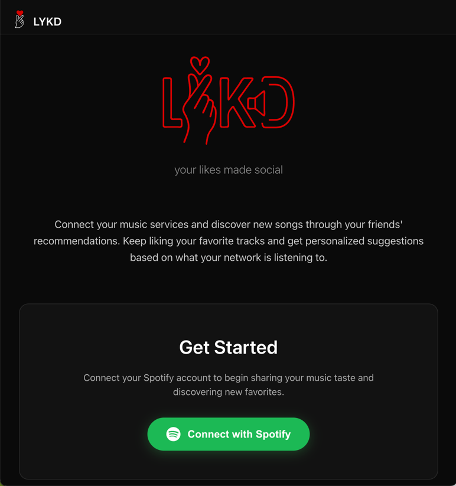
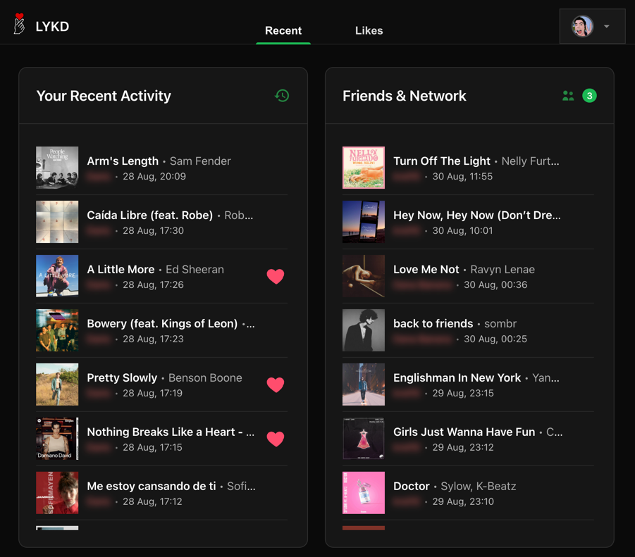

<div align="center">
  
</div>

# LYKD - Your Likes Made Social

LYKD is a web application that makes your music likes social.
This project is a continuation and evolution of the
previous [Spotlike](https://github.com/dariosky/spotlike) script by the same author, now
rebuilt as a full-stack web application.

This is still a work in progress - but it's usable and available
at [lykd.it](https://lykd.it).

<p style="text-align: center">
    
    
    
</p>

## Project Structure

This is a full-stack application with:

- **Backend**: FastAPI-based Python backend with SQLModel for database operations
- **Frontend**: React with TypeScript, built with Vite

## Development Environment Setup

### Prerequisites

- Python 3.13+
- Node.js and npm
- Git
- [uv](https://docs.astral.sh/uv/) (Python package manager)

### Initial Setup

1. **Clone the repository**
   ```bash
   git clone git@github.com:dariosky/lykd.git
   cd lykd
   ```

2. **Install Python dependencies**
   ```bash
   uv sync --group dev
   ```

3. **Install frontend dependencies**
   ```bash
   cd frontend
   npm install
   cd ..
   ```

4. **Install pre-commit hooks**
   ```bash
   uv run pre-commit install
   ```

### Running the Application

#### Backend Development Server

```bash
cd backend
uv run python run_dev.py
```

#### Frontend Development Server

```bash
cd frontend
npm run dev
```

### Code Quality and Formatting

This project uses pre-commit hooks to maintain code quality:

- **Backend**: Ruff for linting and formatting Python code
- **Frontend**: Prettier for formatting TypeScript/React code

The pre-commit hooks will automatically run before each commit. You can also run them
manually:

```bash
# Run pre-commit on all files (format, lint, tests)
uv run pre-commit run --all-files
```

### Available Scripts

#### Backend

- Database migrations are handled with Alembic
- Run `uv run python migrate_data.py` for data migrations from Spotlike

#### Frontend

- `npm run dev` - Start development server
- `npm run build` - Build for production
- `npm run lint` - Run ESLint
- `npm run lint:fix` - Fix ESLint issues
- `npm run format` - Format code with Prettier
- `npm run format:check` - Check formatting without changes
- `npm run test` - Run tests
- `npm run test:ui` - Run tests with UI
- `npm run test:coverage` - Run tests with coverage

## Technologies Used

### Backend

- FastAPI
- SQLModel (SQLAlchemy + Pydantic)
- Alembic for migrations
- Uvicorn ASGI server
- AuthLib for authentication
- Ruff for code quality

### Frontend

- React 18
- TypeScript
- Vite
- React Router
- TanStack Query
- Vitest for testing
- Prettier for code formatting

## About Spotlike

This project builds upon the foundation of Spotlike, a Python script that originally
provided functionality for managing Spotify music data.
LYKD expands on this concept by creating a full web application that makes your music
preferences social and shareable.

# TODO:

- [x] Create a public user dashboard (with very broad stats)
- [x] Allow to import full streaming history
  from [Spotify privacy page](https://www.spotify.com/ca-en/account/privacy/)
- [x] Friend requests and acceptance flow
- [x] Do a quick sync of likes often - and a full sync (for deletions) every 12h
- [x] Add an ignore and report button (to ignore and propose a global ignore)
- [x] Add Likes page
- [x] Add a web player
- [x] Add a "like" button
- [x] Support both Spotlike and Lykd app and migrate users
- [x] Send email for friend requests
- [x] Deploy
- [ ] Deduplicate and show aliases as liked
- [ ] Add suggestions (including songs listened recently)
- [ ] Sync playlists (include snapshots)
- [ ] Sync followed artists
